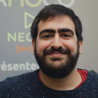

---
hide:
  - navigation
---

# About

Hi there! I'm André.

## Work

I work as a Technical Product Manager at [Famoco](http://famoco.com).

Before that, I worked as a Backend Developer and a Technical Team Leader for several years.

## Education

I hold a Bachelor's degree in Computer Science and a Master's degree in 
[Information and Communication Science and Technology](https://mastic.ulb.ac.be/), both from the
[Université Libre de Bruxelles](https://www.ulb.be/).

## Colophon

This website is built with [Material for MkDocs](https://squidfunk.github.io/mkdocs-material/), and thus
indirectly with [MkDocs](https://www.mkdocs.org/) itself.
